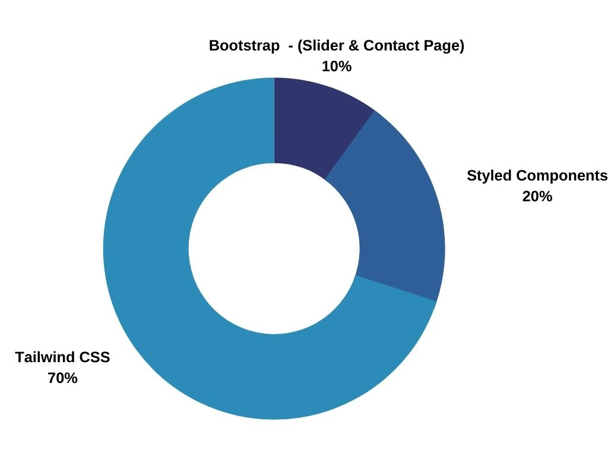

# Tourism Company website.

### Project 02

---

This website is a tourism oriented business, in which i applied some Front End tools to replicate a website in which i think it has a nice
User Interface & Experience, because of it's easy and useful way to sort out a common problem when you are trying to go vacations. 👉 [BarlanTravel.com](https://www.barlantravel.com/)

### **Technologies used**

This website was made using these technologies:

- HTML
- CSS
- JavaScript
- styled-components 💅
- Tailwind CSS
- ReactJS
  - Hooks
  - Custom Hooks
  - react-router
- Redux Toolkit
  - createAsyncThunk - createSlice
  - createApi
- Git & Github

| Styling technologies used in this project                                       |
| ------------------------------------------------------------------------------- |
|  |
|                                                                                 |

### **Why i used/learned this libraries/frameworks**.

> **ReactJs** in combination with **Hooks** & **custom Hooks**

Im using **React** for the creation of reusable components easy to maintain, i tried to keep the information received by the components as easy to understand as possible and convenient.
With the combination also of classic props to components children and useContext Hook for handle some state-management. 
Later Redux library was implemented too.

It this project were used:

1. useState()
1. useEffect()
1. useRef()
1. useContext()
1. useCallback()

- useLocalStorage()
- useWindowSize()
- ~~GetUserLocation~~()

Apart of various Pure Functions implementations in certain occasions where i found them useful.

> **State management** using **useContext** and **Redux Toolkit**
>
> I used the **useContext** hook provided by React to handle the state of the Weather API info because i need the information in the header, and second when the weather's modal is opened (made with createPortal()). The difference is that in the header i need information of day 1 and in the modal im calling information for the next 5 days.

Next, i used **Redux Toolkit** to manage the PlacesAPI information as i thought that the useContext file would get messy and most important was that if 1 part would need to render all the rest would re-render unnecessary causing performance issues. 
Here i used _createAsyncThunks_ methods and all its procedure to make the 3 necessary API calls to get what were required. Last one call was made using createApi method.

> Pages Routing using **react-router/-dom v6**

Used in this project this routing library to easily handle pagination and provide awesome performance. 
Usage of useParams hook to get the unique id of the Place clicked on the Home page, and display it's content on the "SinglePlace" page.  
useLocation hook was also implemented for styling purposes (styled-components).

<!-- styled-components (Used 100% to set up the "SinglePlace" pages)

(Slider & Contact Page) -->
